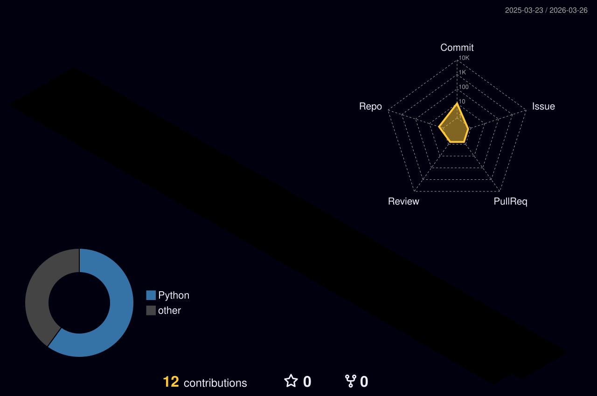

<div align="center">

[](https://readme-typing-svg.demolab.com)


</div>

---

## 🧑‍💻 About Me

```yaml
name:       Salvador Pereira
alias:      ZlDE0N
role:       Platform & DevOps Engineer
company:    HyperNovaLabs
location:   Panama 🇵🇦
focus:
  - Azure cloud infrastructure & migrations
  - CI/CD pipelines · GitHub Actions
  - Microservices · Containers · Terraform
  - .NET · Node.js · Python · Go
currently:  Migrating Azure DevOps → GitHub at scale
```

---

## ⚡ Tech Stack

<div align="center">

### ☁️ Cloud & DevOps


### 💻 Languages & Frameworks


### 🛠️ Tools & Platforms


</div>

---

## 📊 GitHub Stats

<div align="center">


&nbsp;&nbsp;


</div>

<div align="center">


</div>

---

## 🌐 3D Contribution Calendar

<div align="center">

<picture>
  <source media="(prefers-color-scheme: dark)" srcset="profile-3d-contrib/profile-night-rainbow.svg" />
  <source media="(prefers-color-scheme: light)" srcset="profile-3d-contrib/profile-south-season-animate.svg" />
  
</picture>

</div>

---

## 🐍 Contribution Snake

<div align="center">

<picture>
  <source media="(prefers-color-scheme: dark)" srcset="https://raw.githubusercontent.com/ZlDE0N/ZlDE0N/output/github-snake-dark.svg" />
  <source media="(prefers-color-scheme: light)" srcset="https://raw.githubusercontent.com/ZlDE0N/ZlDE0N/output/github-snake.svg" />
  
</picture>

</div>

---

<div align="center">

**"Automate everything, ship fast, sleep well."**


&nbsp;


</div>
